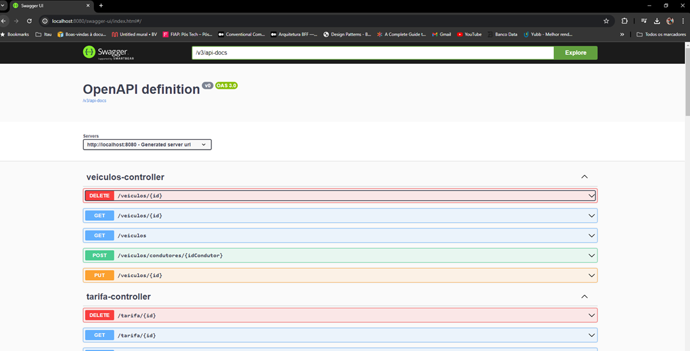

# NEW-PARQUÍMETRO

Seja bem-vindo ao Tech Challenge FIAP - NEW-PARQUÍMETRO!

O objetivo principal deste projeto é refazer uma solução de parquímetros, que atualmente apresenta atrasos e erros na gravação e leitura dos dados. Você deve modernizar o código, implementando uma solução otimizada e eficiente.

#### Desafio
Seu desafio é refazer a solução do parquímetro, utilizando os conceitos de APIs, Persistência de dados e tudo mais aprendido até agora. No entanto, é importante ressaltar que você não terá acesso ao código original, sendo livre para escrever o seu próprio código.

Ao refazer a solução, você deve considerar os seguintes requisitos:
	- Utilize APIs modernas para melhorar a eficiência do sistema. Por exemplo, utilize as classes e métodos da API de datas e horas do Java para facilitar o cálculo do tempo de estacionamento.
	- Implemente uma estrutura de persistência de dados eficiente. Utilize um banco de dados (pode ser em memória ou físico, SQL ou NoSQL), para armazenar as informações sobre os veículos estacionados. Isso permitirá um acesso rápido e confiável aos dados.
	- Otimize os processos de gravação e leitura dos dados. Utilize técnicas para minimizar a necessidade de acesso frequente ao banco de dados. Isso ajudará a reduzir os atrasos e melhorar o desempenho geral do sistema.
	- Considere a escalabilidade do sistema. Embora o desafio não exija a implementação de um sistema distribuído, é importante projetar a solução de forma que ela possa lidar com um grande volume de dados e ser facilmente escalável no futuro.

#### Este projeto está em fase de desenvolvimento!

Tecnologias Utilizadas:
  - Java 17;
  - Spring framework 3.2.5;
  - H2;
  - Lombok
  
Para subir rodar o projeto local:
  - mvn clean package.
  - No terminal rodar os comandos:
    - docker build -t new-parquimetro .
    - Aguardar a finalização...
    - docker run -dp 8080:8080 new-parquimetro

## Payload ###

Disponibilizamos o Swagger com os endpoints criados, para acessa-los deve-se utilizar o seguinte link:
http://localhost:8080/swagger-ui/index.html#/
 

